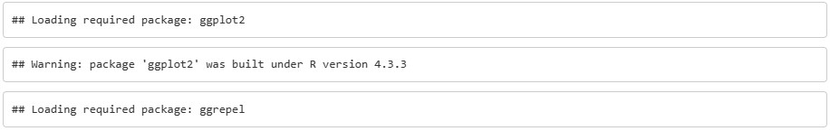
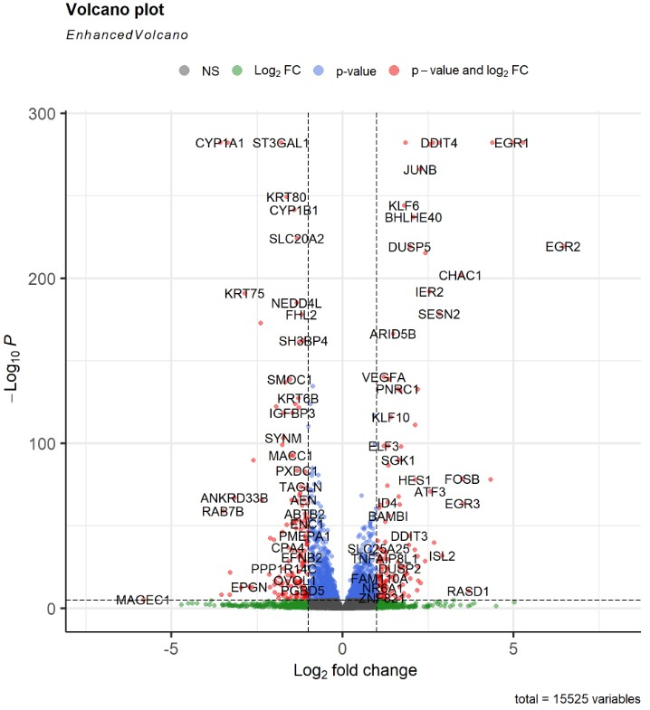
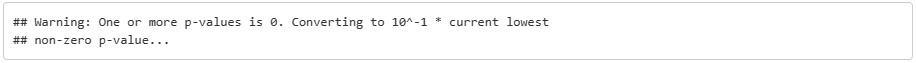
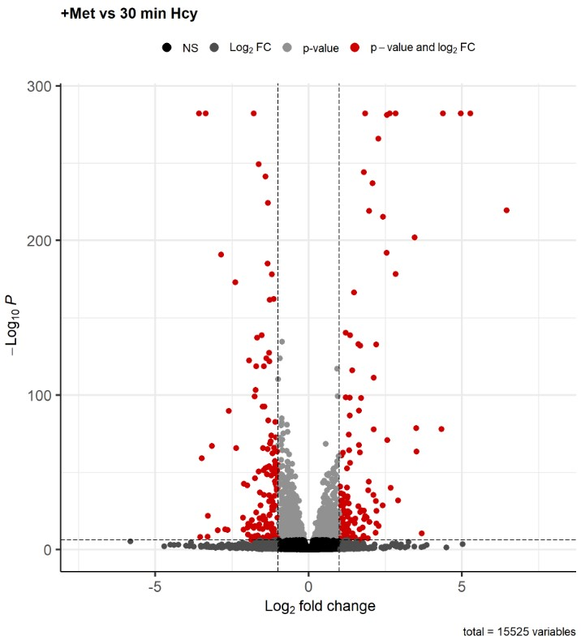
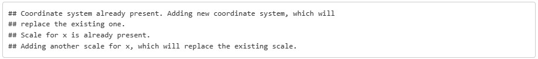
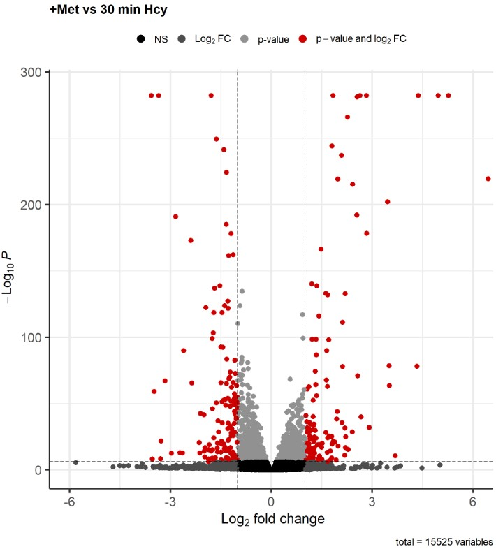

# [Franco](https://github.com/altsplicer) / [***EnchancedVolcano***](https://altsplicer.github.io/EnhancedVolcano_script/EnhancedDE_VP.html)
[](#nolink)

Script [LINK](https://github.com/Altsplicer/EnhancedVolcano_script/blob/main/r/EnhancedDE_VP.R)
## Overview

This a walk-through of the EnhancedVolcano script used for Met Cancer project in the Hertel and Kaiser lab. EnhancedVolcano is a R package created by Kevin Blighe and colleagues from Bioconductor used in creating publication-ready volcano plots to visualize the results of a differential expression analysis. See the following link for a general [EnhancedVolcano](https://bioconductor.org/packages/release/bioc/vignettes/EnhancedVolcano/inst/doc/EnhancedVolcano.html) tutorial. You can also see this walk-through via this [link](https://altsplicer.github.io/EnhancedVolcano_script/EnhancedDE_VP.html).

## Load data frame

``` r
# my_data refers to the data frame of a DeSEQ2 result
# Requires at least the following: column for variable names (can be rownames); a column for log2 fold changes; a column for nominal or adjusted p-value.
my_data <- read.delim("MB468_0v30_VP.txt", row.names = 1)
```

## Install and load EnhancedVolcano package

``` r
# uncomment the last next three lines to install EnhancedVolcano
# if (!requireNamespace('BiocManager', quietly = TRUE))
#    install.packages('BiocManager')
# BiocManager::install('EnhancedVolcano')

# This package is used to make publication-ready volcano plots to visualize the results of differential expression analyses.
# my_data refers to the 
library(EnhancedVolcano)
```
[](#nolink)

## Plot a basic volcano plot

``` r
# lab = the column name containing the gene names.
# x = the column name containing log2 fold changes.
# y = the column name containing adj p-values.
 EnhancedVolcano(my_data,
    lab = rownames(my_data),
    x = 'log2FoldChange',
    y = 'Pvalue')
```
[](#nolink)
[](#nolink)

## Example of volcano plot customization for the Met Cancer project

``` r
# Store R command in p1 to make the volcano plot easier to work with during customization.
# selectlab allows to call out certain gene to highlight based on gene name. In this case I used 'NONE' so the program would not highlight any gene.
# title = your chosen title.
# pCuttoff = cutt-off for statistical significance.
# FCcuttoff = cut-off for absolute log2 fold-change.
# pointSize = Size of plotted point for each variable.
# subtitle refers to just that, the subtitle in the plot. If the option isn't used then the default subtitle is "EnhancedVolcano".
# labSize = Size of labels for each variable.
# col = color of the 4 legend labels.
# colAlpha = Alpha for the purposes of controlling color transparency of variable.
p1 <- EnhancedVolcano(my_data,
                lab = rownames(my_data),
                x = 'log2FoldChange',
                y = 'Pvalue',
                selectLab = c('NONE'),
                title = '+Met vs 30 min Hcy',
                pCutoff = 7.34e-07,
                FCcutoff = 1 ,
                pointSize = 3.0,
                subtitle = NULL,
                labSize = 6.0,
                col=c('black', 'gray30', 'gray57', 'red3'),
                colAlpha = 1)
```
[](#nolink)

``` r
#call the volcano plot stored in "p1"
p1
```
[](#nolink)

# Further customization 
The package used the very powerful ggplot2 package to make the volcano plot, so you can use the ggplot options to customize the plot.
```{r, fig.width=10,fig.height=11}
# You can google the different ggplot2 options.
# In this example the scaling of the x axis and text size was changed
p1 +
  ggplot2::coord_cartesian(xlim=c(-6, 6)) +
  ggplot2::scale_x_continuous(
    breaks=seq(-6,6, 3)) + theme(axis.title.x = element_text(size=20))
```
[](#nolink)
[](#nolink)
